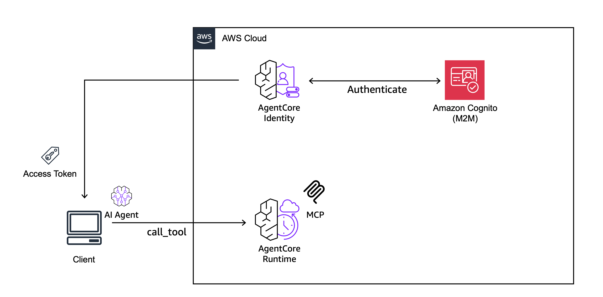

# AWS Bedrock AgentCore Remote MCP

Amazon Bedrock AgentCore を利用して Remote MCP サーバーを実現する 2 つの方法の検証コード

> [!NOTE]
> Zenn の記事で利用している検証コードです。是非以下もご覧下さい！
> https://zenn.dev/aws_japan/articles/001-bedrock-agentcore-remote-mcp

## 概要

本リポジトリでは、以下の 2 つのアプローチで Remote MCP サーバーを構築する方法を提供します。CDK の実装を公開しております。

1. **AgentCore Gateway + Lambda**: 既存の Lambda 関数を MCP サーバーとして利用
2. **AgentCore Runtime**: Docker コンテナで MCP サーバーをホスト

詳細な比較検証については、[Zenn ブログ記事](https://zenn.dev/aws_japan/articles/001-bedrock-agentcore-remote-mcp)をご参照ください。

## アーキテクチャ

### (1) AgentCore Gateway + Lambda


Lambda 関数を MCP サーバーとして利用する構成です。既存の Lambda を流用できる点や、低レイテンシーである点が特徴です。

### (2) AgentCore Runtime



Docker コンテナで MCP サーバーをホストする構成です。開発・運用が容易で、柔軟な実装が可能です。

## ディレクトリ構成

```
.
├── agentcore-gateway/         # AgentCore Gateway + Lambda の実装
│   ├── cdk-gateway/           # CDK スタック
│   ├── mcp-client/            # MCP クライアント実装
│   └── measure_latency/       # レイテンシー計測コード
├── agentcore-runtime-mcp/     # AgentCore Runtime の実装
│   ├── cdk-runtime-mcp/       # CDK スタック
│   ├── mcp-client/            # MCP クライアント実装
│   └── measure_latency/       # レイテンシー計測コード
└── agentcore-identity/        # AgentCore Identity の作成スクリプト
```

## クイックスタート

各ディレクトリの README.md に詳細な手順を記載しています。

- [AgentCore Gateway のデプロイ手順](./agentcore-gateway/cdk-gateway/README.md)
- [AgentCore Runtime のデプロイ手順](./agentcore-runtime-mcp/cdk-runtime-mcp/README.md)
- [AgentCore Identity の作成手順](./agentcore-identity/README.md)

## 検証結果サマリー

| 観点               | AgentCore Runtime                  | AgentCore Gateway + Lambda             |
| ------------------ | ---------------------------------- | -------------------------------------- |
| 開発・運用の容易性 | ○ MCP サーバーの実装のみで完結     | △ Lambda と Inline Schema の両方を管理 |
| 実行環境の柔軟性   | ○ ペイロード 100MB、最大 60 分実行 | △ ペイロード 6MB、最大 15 分実行       |
| レイテンシー       | 約 3.6 秒                          | 約 1.7 秒 (約 2 倍高速)                |
| コスト             | $0.1058/時間                       | $0.1038/時間 (ほぼ同等)                |

詳細な検証結果は[ブログ記事](https://zenn.dev/aws_japan/articles/001-bedrock-agentcore-remote-mcp)をご覧ください。

## 各手法の使い分け

### AgentCore Runtime を推奨するケース

- MCP サーバーを新規開発する場合
- 大きなペイロードや長時間実行が必要な場合
- ローカルでのテスト・開発を重視する場合

### AgentCore Gateway + Lambda を推奨するケース

- 既存の Lambda 関数を流用したい場合
- 低レイテンシーが求められる場合
- 複数の MCP サーバーを統合管理したい場合

## 必要な環境

- AWS アカウント
- Node.js (CDK 用)
- Python 3.13+ (MCP サーバー・クライアント用)
- Docker (AgentCore Runtime 用)
- OpenAI API キー (検証用 MCP サーバーで使用)

## ライセンス

MIT License

## 参考リンク

- [Zenn ブログ記事](https://zenn.dev/aws_japan/articles/001-bedrock-agentcore-remote-mcp)
- [Model Context Protocol](https://modelcontextprotocol.info/)
- [Amazon Bedrock AgentCore Documentation](https://docs.aws.amazon.com/bedrock-agentcore/)
